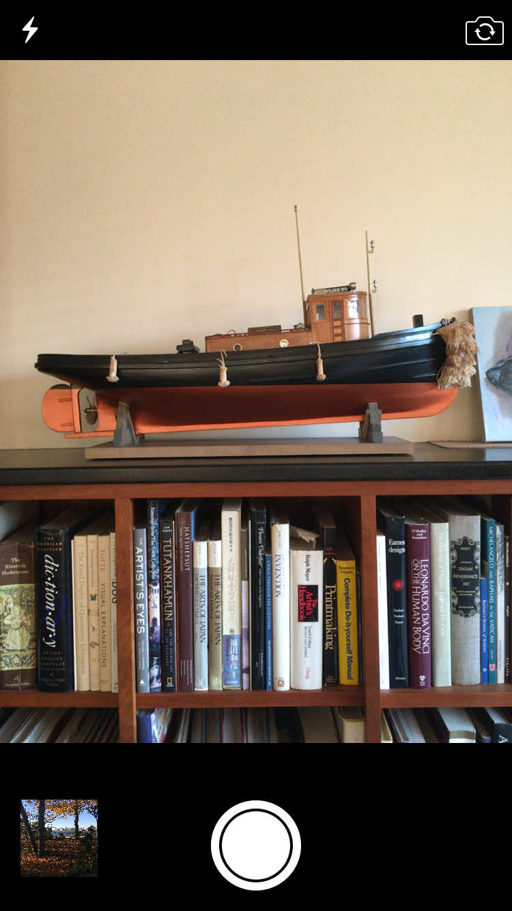
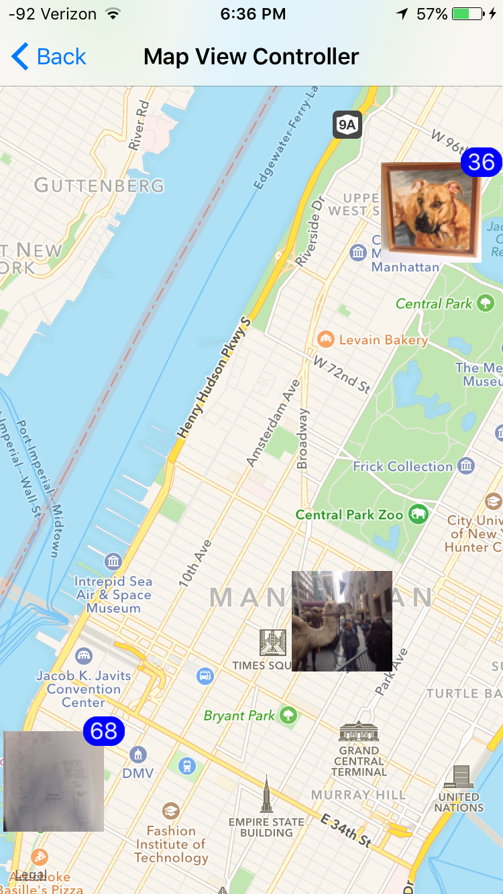
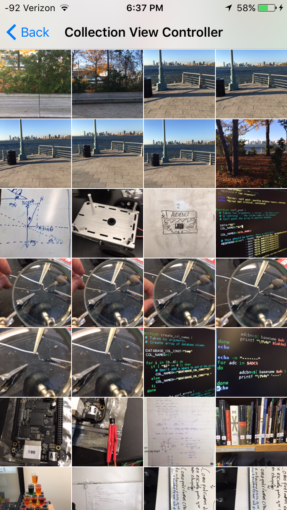
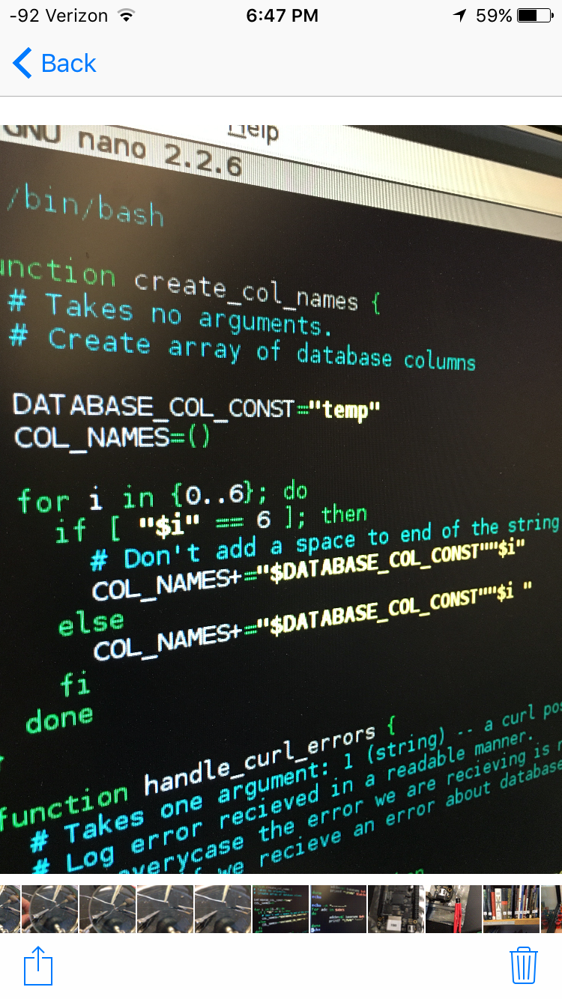

# Image Map

This app integrates with your photo library, and camera, to create a single app where you can take photos and view all of the photos in your camera roll on a geo map.

<link rel="stylesheet" type="text/css" href="style.css">

	<a href="ExampleImages/CameraView.PNG" id="ExampleImage">
		<figure>
			
		</figure>
	</a>
	<a href="ExampleImages/MapView.PNG" id="ExampleImage">
		<figure>
			
		</figure>
	</a>
	<a href="ExampleImages/CollectionView.PNG" id="ExampleImage">
		<figure>
			
		</figure>
	</a>
	<a href="ExampleImages/ImageView.PNG" id="ExampleImage">
		<figure>
			
		</figure>
	</a>

<!-- 

 -->

## Libraries Used

The bulk of the image clustering was done using a library found at https://github.com/ribl/FBAnnotationClusteringSwift.  The library was customized to suit the apps particular needs.
